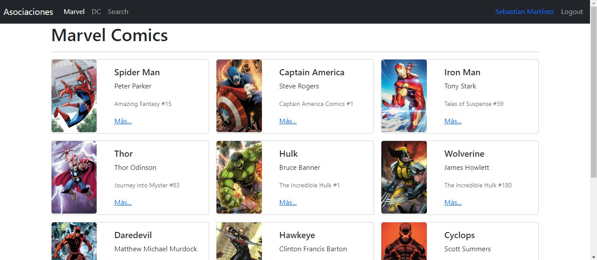
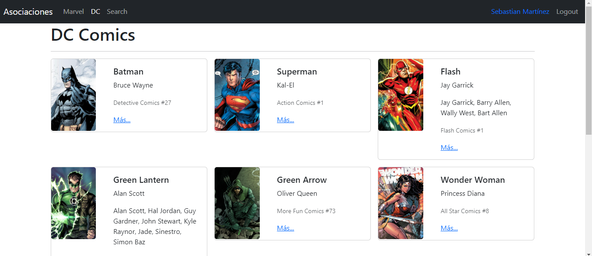
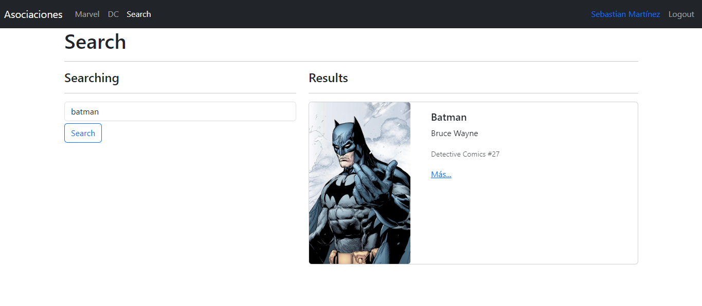
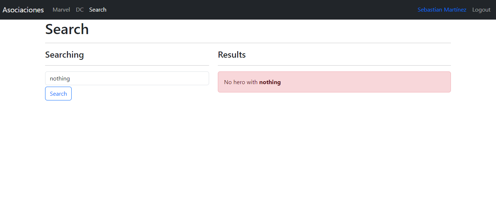

# React + Vite

  La aplicación se realizo con ayuda de las tecnologías de React + Vite. Este proyecto es un seguimiento del profesor Fernando Herrera en su plataforma DevTalles.
  
  Que temas contiene este proyecto:
  
-   SPA ( Single Page Application ) a profundidad    
-   Diferentes temas en la misma aplicación aplicados a diferentes rutas    
-   Multiples Routers    
-   Push y Replace en el History    
-   Leer argumentos por URL    
-   QueryParams    
-   Aplicar filtros utilizando QueryStrings 
-   Rutas públicas    
-   Rutas privadas    
-   Login y logout - Sin backend aún    
-   Recordar cuál fue la última ruta visitada para mejorar la experiencia de usuario.    
-   Context    
-   Reducer    

En la parte principal muestra un listado de héroes que se dividieron en dos grupos, los héroes de Marvel y los de DC.

**Marvel**

**DC**

## Pantalla de búsqueda
Contamos con una pantalla de búsqueda. En este punto puede retornar todos los héroes que coincidan con el termino de búsqueda o podrá retornar un mensaje que no se encuentra ningún héroe.

**Heroe encontrado**

**Sin resultados**

## Testing

Se hicieron pruebas unitarias con Jest. Estas pruebas se encuentran en la carpeta `/test`